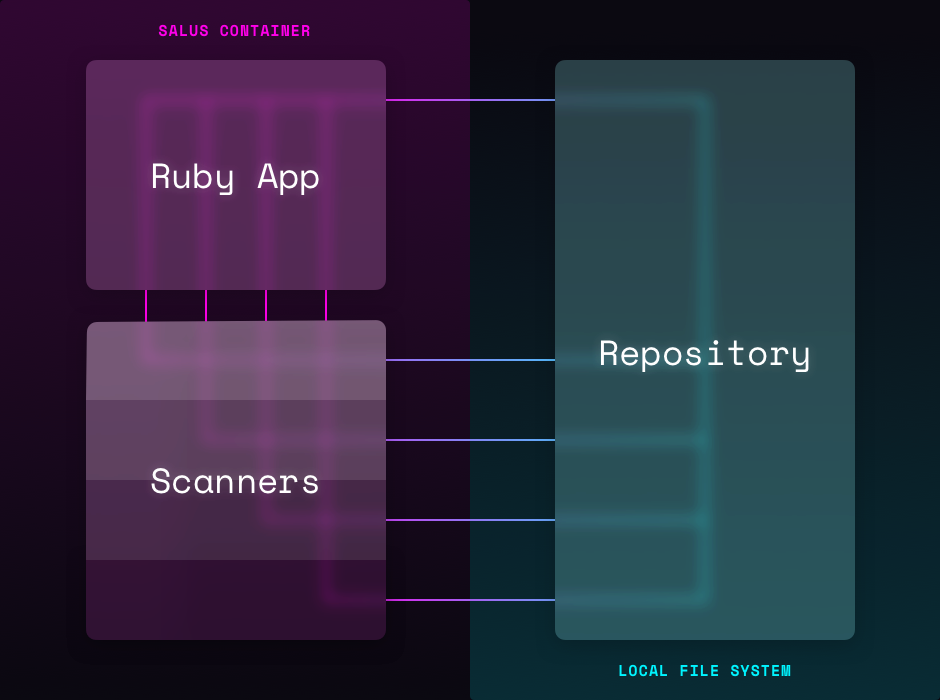

# Salus Architecture

Salus is a docker container. Installed into the container are security scanners and a small ruby application that coordinates them.



The source code being scanned is volumed into the container and Salus expects to find this code at the internal path `/home/repo`. While the Salus application is written in Ruby, other languages are installed in the container as required for each scanners.

## Ruby Objects

  - [`Salus`](../lib/salus.rb): the primary class of the application.
  - [`Salus::CLI`](../lib/salus/cli.rb): command line wrapper to run Salus.
  - [`Salus::Config`](../lib/salus/config.rb): object that maintains Salus' configuration.
  - [`Salus::Processor`](../lib/salus/processor.rb): runs each scanners against the repo.
  - [`Salus::Repo`](../lib/salus/repo.rb): representation of the repository being scanned.
  - [`Salus::Report`](../lib/salus/report.rb): object that collects data about scans and compiles a report.
  - [`Salus::Scanners::<name>`](../lib/salus/scanners): scanner objects that can determine if a scanner should run, runs the scanner and collect the results.

# Plugins

To simplify extension Salus supports light weight plugin architecture.  We use the mediator pattern for filters and the observer pattern for events.

## Filters

Filters enable the plugin to modify data.  Each filter belongs to a filter group.

`Group :salus_config Supported Methods :filter_config`

- filter_config is used to override the loaded configuration after the cascade has been applied

`Group :salus_report, Supported Methods :filter_report_hash`

- filter_report_hash allows mutating the report hash values.  Use this filter if you want to customize any data being written to a report
```
# Example

class MyFilter
  def filter_report_hash(report_hash)
  	# Add some hash mutation here
  	return report_hash
  end
end

filter = MyFiler.new
Salus::PluginManager.register_filter(:salus_report, filter) 


```


## Events

Events are published, plugins can register listeners for events.
`Event :cli_startup`

- cli_startup is called when bin/salus calls out the Salus::CLI.start(ARGV) to begin the cli.  ARGV is passed as the data to this event

`Event :cli_scan`
`Salus::PluginManager.send_event(:cli_scan, options)`

- cli_csan is called once the cli begins the scan,  The CLI options are passed as the data to the event

`Event :salus_scan`

- salus scan. This event will be called with the Salus scan has begun.  The data playload will be the params passed to the Salus.scan method

`Event: skip_scanner`

- skip_scanner will be called if the scanner is determined to be non-active or not relevant for the codebase. The data playoad is the scanner name string.

`Event: run_scanner`

- run_scanner is called immediately before running the scanner.  Only scanners that have been determined relevant for the codebase will trigger this event.  The data playoad is the scanner name string.

`Event: scanners_ran `

- scanners_ran will be invoked after all scanners have ran.  The data playload will be an array of scanners ran and a second parameter for the SalusReport object

`Event :run_shell`

- run_shell is called when a scanner executes a shell command to run a native scanner.  The data payload will be the array of arguments.

`Event :report_warn`

- report_warn will be invoked during scans if a scanner has determined a warning is necessary.  The data payload will be the type of warning and corresponding message.
